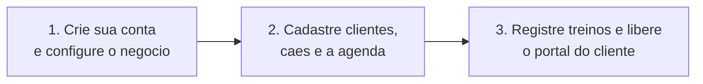

# Adestro — Apresentação Comercial

### *Toda a sua operação de adestramento em um só lugar — agenda, treinos, clientes, financeiro e portal do cliente.*

**Versão:** 1.0 · 25/06/2026 · documento comercial

---

## 🎯 O problema

O adestrador profissional perde tempo e dinheiro com a operação espalhada:

- **Agenda no caderno ou no WhatsApp** → horários esquecidos, clientes marcados em cima um do outro.
- **Evolução do cão na cabeça ou em fotos soltas** → na hora de mostrar resultado pro cliente, falta histórico.
- **Cobrança manual** → sessões esquecidas de cobrar, recibos improvisados.
- **Cliente sem acompanhamento** → ele não vê o progresso, não engaja, e acaba **cancelando**.
- **Imagem amadora** → planilha e mensagem solta não passam a confiança que o trabalho merece.

> O adestramento é excelente. O que falta é uma **ferramenta à altura** do profissional.

---

## ✅ A solução: Adestro

O **Adestro** é a plataforma que organiza, profissionaliza e automatiza todo o negócio do adestrador — do primeiro contato com o cliente até o relatório de evolução do cão — em **um só lugar**, no celular ou no computador.

---

## 💡 O que você ganha

| Resultado | Como o Adestro entrega |
|-----------|------------------------|
| **⏱️ Economize horas toda semana** | Cadastro com CEP automático, modelos de treino reutilizáveis e **IA que escreve o resumo da sessão pra você**. |
| **🎓 Passe profissionalismo** | Visual sóbrio e moderno, ficha completa de cada cão e **relatórios de evolução** com a sua marca. |
| **❤️ Fidelize e reduza cancelamentos** | **Portal do cliente**: o dono acompanha a evolução do cão, recebe tarefas de casa e conversa com você — engajamento que segura o cliente. |
| **💰 Aumente o faturamento** | Pacotes, contratos, cobrança no **Pix** e recibo no WhatsApp — você não esquece de cobrar e recebe mais rápido. |
| **📵 Nunca perca um horário** | Agenda com **aviso de conflito**, lembretes e confirmação automática por WhatsApp. |

---

## 🧩 Tudo que o Adestro faz por você

**Clientes e cães**
- Carteira completa de clientes e cães, com **ficha rica** (raça, idade, vacinas, temperamento, rotina, objetivos).
- **Histórico de cada treino** do cão num só lugar.

**Agenda**
- Aulas individuais e **turmas**, em qualquer data, com aviso de conflito e **recorrência** automática.

**Registro de treino**
- Atividades, comandos, **nota por estrelas**, resumo para o cliente, notas privadas, **gravação por voz** e fotos.
- **Inteligência Artificial** que gera o resumo da sessão — é só revisar e enviar.

**Portal do cliente**
- O dono do cão acompanha a **evolução**, recebe **tarefas de casa**, confirma presença e dá feedback.

**Financeiro**
- Pacotes, contratos, faturas, **Pix** e recibos — controle total do que entra.

**Comunicação**
- Mensagens prontas de **WhatsApp** (lembrete, confirmação, cobrança, recibo) e **notificações** no celular.

**Funciona como app**
- Instalável no celular, **funciona até offline** (PWA), sem precisar baixar de loja.

---

## 🏆 Por que o Adestro é diferente

1. **Feito para adestramento — não é um CRM genérico.** Tem evolução comportamental, fases de treino e planos — a linguagem do seu negócio.
2. **Tudo em uma ferramenta só.** Substitui agenda + planilha + cobrança + grupo de WhatsApp por uma plataforma integrada.
3. **Portal do cliente que fideliza.** Poucos concorrentes entregam essa experiência ao dono do cão.
4. **IA que economiza tempo.** O resumo da sessão sai pronto, no seu lugar.
5. **Profissionaliza a sua marca.** Seu cliente percebe que está com um profissional sério.

---

## 👥 Para quem é

- **Adestrador autônomo** que quer parar de perder tempo com planilha e passar mais profissionalismo.
- **Escolas e canis com equipe** que precisam padronizar o atendimento e dividir a operação (multi-adestrador).
- **Profissionais que querem escalar** a carteira sem perder o controle.

---

## 🚀 Como começar (em 3 passos)

Em poucos minutos você já está com a operação organizada e o cliente acompanhando a evolução.

---

## 💳 Planos *(estrutura sugerida — valores a definir)*

| Plano | Para quem | Inclui | Valor |
|-------|-----------|--------|:-----:|
| **Teste grátis** | Conhecer a plataforma | Acesso completo por período de avaliação | Grátis |
| **Essencial** | Adestrador começando | Clientes, agenda, treinos, financeiro | R$ __/mês |
| **Profissional** | Carteira ativa | Tudo do Essencial + **IA**, **portal do cliente**, relatórios, WhatsApp | R$ __/mês |
| **Escola / Equipe** | Vários adestradores | Tudo do Profissional + **multi-adestrador** e gestão | R$ __/mês |

> *Modelo de assinatura recorrente (SaaS). Os valores podem ser ajustados conforme posicionamento e mercado.*

---

## 🔧 Por dentro: um produto robusto (e pronto)

Não é um protótipo — é uma plataforma **completa e em produção**:

| | |
|---|---|
| **+30.000** linhas de código | **31** telas |
| **40** integrações internas (APIs) | **26** áreas de dados |
| **43** componentes de interface | **132** versões publicadas |
| Desenvolvido em **~3 meses** | Hospedado em infraestrutura escalável (nuvem) |

Tecnologia moderna (Next.js, IA, PWA), segurança por perfil e isolamento de dados — **no nível de plataformas que cobram mensalidade**.

---

## 🔭 O que vem por aí

Evolução contínua já mapeada: **sincronização nativa com o Google Agenda**, **gráficos de tendência** da evolução comportamental e mais automações de relacionamento com o cliente.

---

## 📞 Vamos conversar

O Adestro já está **no ar e funcionando**. O próximo passo é colocar a sua operação dentro dele e sentir a diferença na primeira semana.

**[ Agende uma demonstração ]** · **[ Comece o teste grátis ]**

---

*Adestro — a plataforma do adestramento profissional.*
