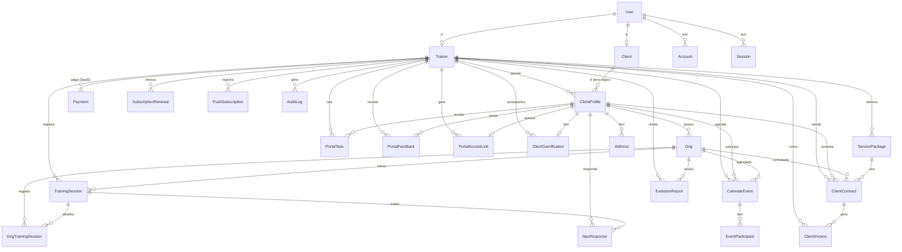
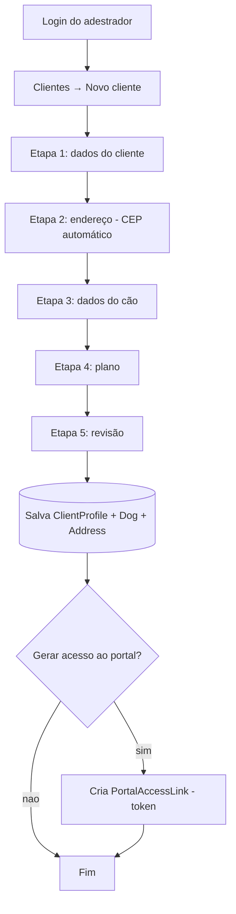
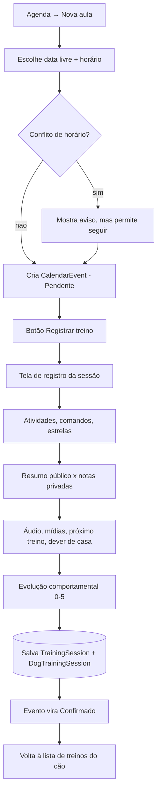
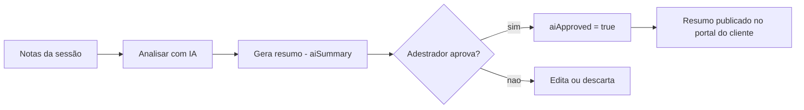
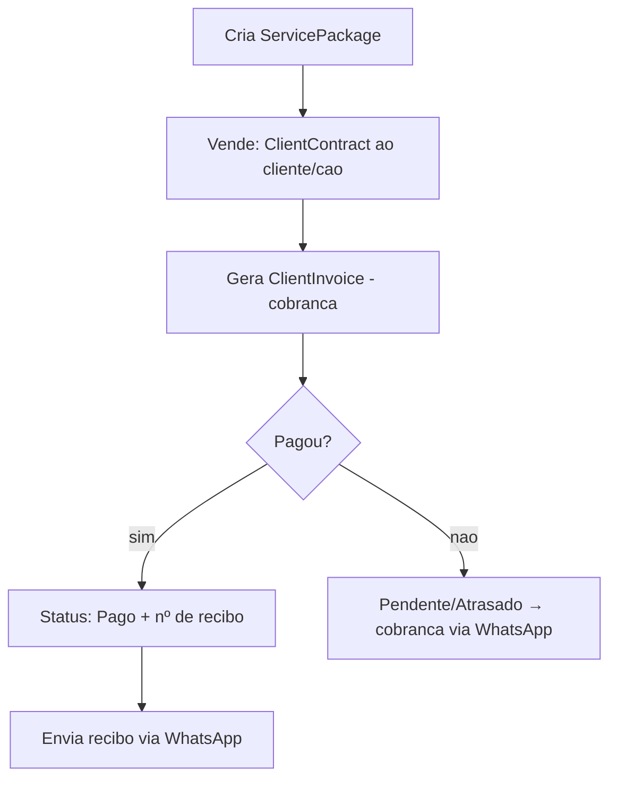
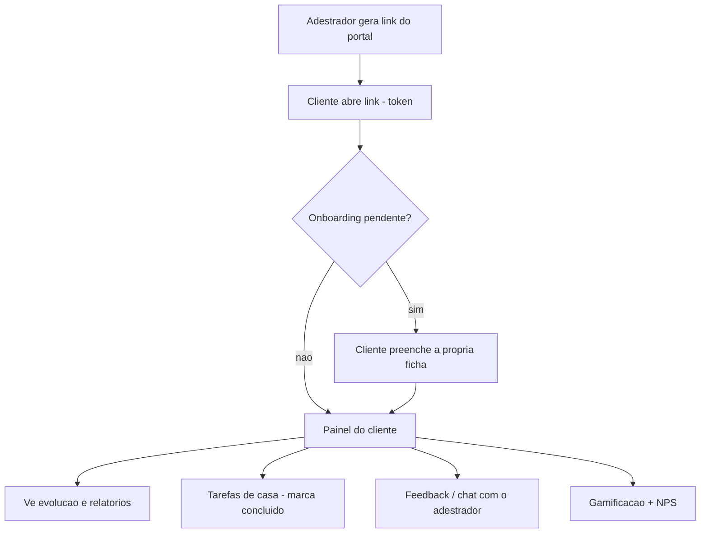
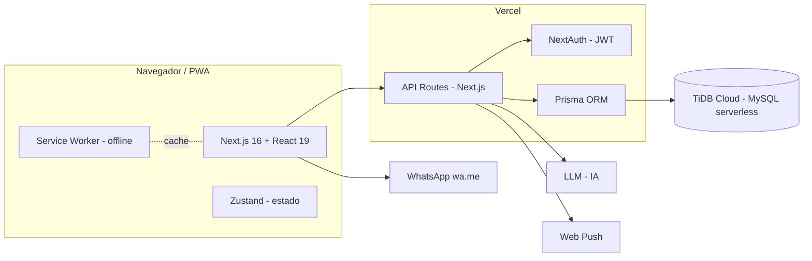

# Adestro — Documento de Escopo Completo do Projeto

**Versão:** 2.0 (completa) · **Data:** 25/06/2026
**Produto:** Adestro — plataforma de gestão para adestradores profissionais de cães
**Natureza:** SaaS B2B · Web responsivo / PWA · arquitetura multi-adestrador

> Os diagramas deste documento usam **Mermaid** — renderizam automaticamente no GitHub e em editores compatíveis.

---

## Sumário

1. Sumário executivo
2. Glossário do domínio
3. Visão geral e objetivos
4. Público-alvo (personas)
5. Perfis de acesso e matriz de permissões
6. Módulos funcionais (detalhado)
7. Inventário de telas (31)
8. Inventário de endpoints de API (40)
9. Modelo de dados — diagrama ER + dicionário (26 entidades)
10. Fluxos de processo (diagramas)
11. Regras de negócio relevantes
12. Integrações
13. Arquitetura técnica
14. Requisitos não-funcionais
15. Dimensão do projeto (números reais)
16. Roadmap
17. Considerações finais

---

## 1. Sumário executivo

O **Adestro** é uma plataforma completa que digitaliza toda a operação de um adestrador profissional: captação e cadastro de clientes e cães, agenda, registro técnico dos treinos, evolução comportamental, financeiro (com Pix), portal de relacionamento com o cliente, inteligência artificial de apoio e comunicação automatizada (WhatsApp e notificações).

É um **sistema operacional do negócio** — não um app de cadastro: tem controle de acesso por perfil, isolamento de dados por adestrador, funcionamento offline (PWA) e base preparada para escalar como SaaS multi-adestrador.

**Em números:** +30.000 linhas de código, 31 telas, 40 endpoints de API, 43 componentes, 26 entidades de banco, 132 versões publicadas, ~3 meses de desenvolvimento contínuo — tudo **em produção**.

---

## 2. Glossário do domínio

| Termo | Significado |
|-------|-------------|
| **Adestrador** | Profissional que usa a plataforma para gerir seu negócio (perfil *trainer*) |
| **Cliente** | Dono do cão (antes chamado "tutor"); pode acessar o portal próprio |
| **Cão** | Animal em treinamento, vinculado a um cliente |
| **Sessão / Treino** | Registro técnico de um encontro de treinamento |
| **Evento de agenda** | Compromisso agendado (pode virar uma sessão registrada) |
| **Aula coletiva (turma)** | Evento com vários cães participantes |
| **Pacote de serviço** | Oferta comercial (ex.: 10 sessões) |
| **Contrato** | Pacote efetivamente vendido a um cliente |
| **Fatura** | Cobrança gerada a partir de um contrato |
| **Portal do cliente** | Área do dono do cão, acessada por link/token |
| **Plano do adestrador** | Assinatura SaaS do profissional na plataforma |

---

## 3. Visão geral e objetivos

### Objetivo
Centralizar, profissionalizar e automatizar a gestão do adestrador, substituindo planilhas, cadernos e WhatsApp solto por um sistema único e rastreável.

### Proposta de valor por público
- **Adestrador:** menos tempo em burocracia, mais tempo com os cães; operação organizada e com cara profissional.
- **Cliente (dono do cão):** acompanha a evolução do animal, recebe tarefas de casa e se comunica com o adestrador por um portal próprio.
- **Negócio/SaaS:** plataforma multi-adestrador com planos, faturamento e administração central.

---

## 4. Público-alvo (personas)

| Persona | Perfil | Necessidade central |
|---------|--------|---------------------|
| **Adestrador autônomo** | Profissional solo | Organizar agenda, clientes e treinos; cobrar e fidelizar |
| **Escola/canil com equipe** | Vários adestradores | Padronizar atendimento e dividir a operação |
| **Dono do cão** | Cliente final | Ver evolução, receber orientações e dar retorno |
| **Operador da plataforma** | Admin SaaS | Gerir contas, planos e faturamento |

---

## 5. Perfis de acesso e matriz de permissões

O sistema reconhece **3 papéis** (`UserRole`: ADMIN, TRAINER, CLIENT), cada um com sua área e isolamento de dados.

| Recurso / Área | Adestrador | Administrador | Cliente |
|----------------|:----------:|:-------------:|:-------:|
| Dashboard / Foco do dia | ✅ | — | — |
| Clientes e Cães (CRM) | ✅ (os seus) | — | — |
| Agenda e Treinos | ✅ (os seus) | — | — |
| Evolução e Relatórios | ✅ | — | parcial (vê os enviados) |
| Financeiro do negócio | ✅ | — | — |
| Configurações do negócio | ✅ | — | — |
| Painel SaaS (adestradores, planos, faturamento, auditoria, modelos) | — | ✅ | — |
| Portal do cliente (evolução, tarefas, feedback, NPS) | gerencia | — | ✅ (via token) |

> **Isolamento de dados:** cada adestrador só enxerga e edita os próprios clientes, cães, agenda e financeiro. Operações sensíveis validam a posse no servidor (ex.: editar um cão só é permitido se ele pertence a um cliente do próprio adestrador).

---

## 6. Módulos funcionais (detalhado)

### 6.1 Autenticação e Onboarding
- Cadastro e login por e-mail/senha (senha com *hash* — bcrypt).
- Sessão por token (JWT) com redirecionamento por perfil; recuperação de sessão automática.
- Tela de boas-vindas e primeiro acesso.
- Exportação dos próprios dados (portabilidade / LGPD).

### 6.2 Dashboard — "Foco do Dia"
- Card dominante da **próxima sessão** (cão, cliente, horário, ações rápidas: registrar, ficha, WhatsApp, remarcar).
- Cartões de resumo: agenda do dia/semana, financeiro, pendências, checklist do dia.
- **Quadro do dia** (kanban: A fazer / Em andamento / Concluído).
- **Resumo diário automático** (rotina agendada — *cron* `daily-brief`).
- **"Cães em atenção"** (alertas operacionais).

### 6.3 CRM — Clientes e Cães
- Cadastro de cliente em **5 etapas** (dados → endereço com **CEP automático** → cão → plano → revisão).
- **Edição completa** da ficha do cliente e do cão.
- **Múltiplos cães por cliente** (adicionar 2º cão ou mais).
- **Ficha do cão dedicada** (`/caes/[id]`): dados cadastrais editáveis + **histórico de treinos** (estrelas, data, resumo).
- Cadastro rico do cão: raça, idade, peso, sexo, castração, microchip, cor, **vacinas**, restrições alimentares, condições de saúde, veterinário, **temperamento**, **rotina**, **objetivos de treino**, **análise ambiental**, fotos e vídeos.
- Busca, seletor Cliente/Cão em destaque, filtros por status, **tags** livres.
- **Importação de clientes por CSV**.
- Aprovação de fichas de onboarding (rascunho → ativo).

### 6.4 Agenda
- Visões **dia / semana / mês**.
- Agendamento **individual** e **coletivo (turmas)** com lista de participantes.
- **Data livre** (qualquer dia) + horário; **aviso de conflito** de horário.
- **Recorrência** (semanal por 4/8/12 semanas).
- Status: agendada, concluída, cancelada, aguardando, recorrente.
- **Remarcar** o próprio agendamento (data/hora).
- **Confirmação individual por cão** em turmas (participantes: pendente/confirmado/recusado).
- Atalhos: registrar treino, confirmar presença (WhatsApp), mapa, abrir no Google Calendar.

### 6.5 Registro de Treinos
- **Página dedicada por sessão**, totalmente editável.
- Atividades e comandos trabalhados (com **modelos salvos e reutilizáveis**).
- **Avaliação por estrelas** (nota da sessão).
- **Resumo público** (vai ao cliente) × **notas privadas** (confidenciais).
- **Transcrição por voz** (notas por áudio).
- **Galeria de mídias** (fotos com compressão automática no dispositivo).
- **Plano do próximo treino** e **dever de casa** para o cliente.
- **Evolução comportamental** (7 categorias, nota 0–5).
- Treino salvo fica **Registrado** automaticamente; ao salvar, retorna à lista do cão.

### 6.6 Evolução e Planos de Treino
- Tela **Evolução comportamental** (obediência, reatividade, socialização, ansiedade, passeio, recall, controle de impulsos).
- Tela **Planos de treino** com fase e progresso (**Sessão X/Y**).

### 6.7 Relatórios
- **Relatório de evolução** com ciclo de vida (Rascunho → Aguardando → Enviado).
- **Geração** e **comparação** entre períodos.
- Relatórios disponibilizados ao cliente no portal.

### 6.8 Financeiro
- **Pacotes de serviço** (avulsa/pacote, fracionado, validade).
- **Contratos** por cliente/cão (sessões, valor, início, status).
- **Faturas** (status: pendente/pago/atrasado; método: **Pix**/dinheiro/cartão/transferência) e **recibos** numerados.
- Visão geral financeira (recebido, pendente, atrasado).
- Cobrança e recibo via **WhatsApp** (mensagens prontas).

### 6.9 Portal do Cliente
- Acesso por **link/token** (com PIN opcional, expiração e revogação — sem senha fixa).
- **Onboarding** do cliente (preenche a própria ficha).
- Acompanhamento da **evolução** e dos **relatórios** do cão.
- **Tarefas de casa** com recorrência (uma vez / todo dia / dias específicos) e registro de conclusão.
- **Feedback / chat** com o adestrador.
- **Gamificação** (pontos, *streak*, conquistas) e **NPS** pós-sessão.

### 6.10 Inteligência Artificial
- **Análise/resumo automático de sessão** (gera o resumo público a partir das notas; o adestrador **aprova** antes de publicar).
- **Chat com IA com contexto** — sabe de qual cão se trata e mantém o histórico da conversa.

### 6.11 Comunicação
- **WhatsApp**: mensagens prontas (agendamento, lembrete, confirmação, cobrança, recibo) preenchidas com os dados do cliente; **templates customizáveis** por adestrador.
- **Notificações push** (Web Push / PWA), com assinatura por dispositivo.

### 6.12 Painel Administrativo (SaaS)
- Gestão de **adestradores** (contas) e **permissões** internas.
- **Planos**, **faturamento** e **renovações** de assinatura.
- **Auditoria** (log de ações: criou/editou/excluiu, com ator e IP).
- **Modelos/templates** (atividades, comandos, tarefas, mensagens de WhatsApp).
- **Overview** administrativo.

### 6.13 Configurações e Tutoriais
- Dados do negócio (nome, documento, endereço, horário, logo) e perfil de pagamento.
- Parâmetros operacionais (antecedência de lembretes, hora do resumo, tolerância de *streak*).
- **Tutoriais guiados** (tours interativos) no painel do adestrador e no portal do cliente.

---

## 7. Inventário de telas (31)

| Área | Rotas |
|------|-------|
| **Público / Acesso** | `/` · `/login` · `/cadastro` · `/bem-vindo` |
| **Operação (adestrador)** | `/dashboard` · `/clientes` · `/caes/[dogId]` · `/agenda` · `/treinos` · `/treinos/registro` · `/evolucao` · `/planos-treino` · `/relatorios` · `/financeiro` · `/planos` · `/configuracoes` |
| **IA** | `/ia` · `/chat` |
| **Portal do cliente** | `/portal` · `/portal/cliente` · `/portal/cliente/[token]` · `/portal/cliente/[token]/onboarding` |
| **Administração (SaaS)** | `/admin` · `/admin/adestradores` · `/admin/audit` · `/admin/faturamento` · `/admin/planos` · `/admin/relatorios` · `/admin/templates` |
| **Tutoriais** | `/tutorial` · `/tutorial/cliente` |

---

## 8. Inventário de endpoints de API (40)

| Domínio | Endpoints |
|---------|-----------|
| **Auth / Conta** | `/auth/[...nextauth]` · `/register` · `/me` · `/me/export` |
| **Clientes** | `/clients` · `/clients/import-csv` · `/clients/tags` |
| **Agenda** | `/events` · `/events/participants` |
| **Treinos** | `/sessions` |
| **IA** | `/ia/analyze-session` · `/ia/session-chat` · `/chat` |
| **Financeiro** | `/finance/contracts` · `/finance/invoices` · `/finance/overview` · `/finance/packages` · `/payments` |
| **Relatórios** | `/relatorios` · `/relatorios/compare` · `/relatorios/generate` |
| **Portal (privado)** | `/portal-tasks` · `/portal-feedbacks` · `/portal-links` |
| **Portal (público por token)** | `/portal-public/[token]` · `/portal-public/[token]/confirm` · `/portal-public/[token]/gamification` · `/portal-public/[token]/nps` · `/portal-public/[token]/onboarding` · `/portal-public/[token]/relatorios` |
| **Adestrador (plano/config)** | `/trainer/plan` · `/trainer/plan-status` · `/trainer/renewals` · `/trainer/settings` · `/trainer/whatsapp-templates` |
| **Administração** | `/admin/audit` · `/admin/overview` · `/admin/trainers` |
| **Infra** | `/push/subscribe` · `/cron/daily-brief` |

---

## 9. Modelo de dados (26 entidades)

### 9.1 Diagrama de relacionamento (ER)

### 9.2 Dicionário de entidades

| Entidade | Propósito | Campos-chave |
|----------|-----------|--------------|
| **User** | Conta de acesso | email, password (hash), role (ADMIN/TRAINER/CLIENT) |
| **Account / Session / VerificationToken** | Suporte ao NextAuth | tokens, expiração |
| **Trainer** | Perfil do adestrador | plano, dados do negócio, parâmetros operacionais, templates |
| **Client** | Vínculo de login do dono do cão | userId |
| **ClientProfile** | Ficha do cliente | nome, telefone, e-mail, CPF, status, tags, plano |
| **Address** | Endereços do cliente | apelido, CEP, rua, número, bairro, cidade, UF, padrão |
| **Dog** | Ficha do cão | raça, idade, peso, sexo, vacinas, temperamento, rotina, objetivos |
| **CalendarEvent** | Evento de agenda | dia, hora, status, recorrência, nº da sessão |
| **EventParticipant** | Cão participante de turma | dogName, clientName, status |
| **TrainingSession** | Sessão registrada | data, tipo, status, notas, mídia |
| **DogTrainingSession** | Detalhe da sessão por cão | atividades, comandos, resumo público, notas privadas, IA, evolução |
| **EvolutionReport** | Relatório de evolução | mês, status, conteúdo, enviado em |
| **NpsResponse** | Satisfação pós-sessão | score, comentário |
| **ServicePackage** | Pacote comercial | sessões, valor, fracionamento, validade |
| **ClientContract** | Pacote vendido | sessões, valor, início, status |
| **ClientInvoice** | Cobrança/recibo | valor, status, método, vencimento, nº recibo |
| **Payment** | Pagamento do adestrador (SaaS) | descrição, valor, status, método |
| **SubscriptionRenewal** | Renovação de assinatura | plano, valor, status |
| **PortalAccessLink** | Link mágico do portal | tokenHash, PIN, expiração, revogação |
| **PortalTask** | Tarefa de casa | título, recorrência, dias da semana, conclusões |
| **PortalFeedback** | Mensagem do portal | autor, mensagem |
| **ClientGamification** | Engajamento do cliente | pontos, streak, conquistas |
| **PushSubscription** | Assinatura de push por dispositivo | endpoint, chaves |
| **AuditLog** | Trilha de auditoria | ação, recurso, ator, IP |

---

## 10. Fluxos de processo

### 10.1 Cadastro de cliente e cão

### 10.2 Agendamento → Treino → Registro

### 10.3 Inteligência Artificial (resumo da sessão)

### 10.4 Financeiro (pacote → recibo)

### 10.5 Portal do cliente

---

## 11. Regras de negócio relevantes

- **Status do treino = estado, não nota:** todo treino salvo é "Registrado"; a qualidade vai para a **nota em estrelas** (separada do status).
- **Isolamento por adestrador:** toda leitura/escrita filtra pelo `trainerId`; edição de cão valida `{ id, clientId }` para impedir acesso cruzado.
- **Recorrência de tarefas:** `once` (uma vez), `daily` (todo dia) ou `weekly` (dias específicos); conclusões registradas por data.
- **Recorrência de eventos:** geração de 4/8/12 ocorrências semanais.
- **Faturamento fracionado:** pacotes podem cobrar a cada *X* sessões; faturas atreladas a sessões ou data.
- **Portal seguro:** acesso por token com *hash*, PIN opcional, expiração e revogação; nunca expõe a base completa.
- **Gamificação:** pontos, *streak* com tolerância configurável, conquistas e progresso mensal.
- **Auditoria:** ações sensíveis registram ator, IP e detalhe.

---

## 12. Integrações

| Integração | Uso | Situação |
|-----------|-----|----------|
| **Inteligência Artificial (LLM)** | Resumo de sessão e chat com contexto | ✅ Ativo |
| **WhatsApp** (links wa.me) | Mensagens prontas (agenda, cobrança, confirmação, recibo) | ✅ Ativo |
| **Notificações Push** (Web Push) | Avisos no dispositivo | ✅ Ativo |
| **Pix** | Cobrança e recebimento | ✅ Ativo |
| **Google Maps** (link) | Endereço do atendimento | ✅ Ativo |
| **Google Calendar** (link) | Abrir o agendamento no calendário | 🟦 Link (sync automático no roadmap) |
| **ViaCEP** | Preenchimento automático de endereço | ✅ Ativo |

---

## 13. Arquitetura técnica

| Camada | Tecnologia |
|--------|-----------|
| Framework / UI | Next.js 16 (App Router), React 19, TypeScript |
| Estilo | Tailwind CSS v4 + design system próprio (fonte Geist; paleta grafite/branco) |
| Autenticação | NextAuth (JWT, controle por perfil) |
| Banco de dados | Prisma ORM + MySQL serverless (TiDB Cloud) |
| Estado (frontend) | Zustand |
| Validação | Zod |
| PWA / Offline | Web App Manifest + Service Worker |
| Notificações | Web Push (web-push) |
| Hospedagem / Deploy | Vercel (deploy contínuo via Git) |
| Analytics | Vercel Analytics |

---

## 14. Requisitos não-funcionais

- **Segurança:** senhas com *hash* (bcrypt); isolamento de dados por adestrador; validação no servidor (Zod); auditoria; tokens de portal com *hash*, PIN, expiração e revogação.
- **Privacidade / LGPD:** exportação dos dados do usuário; separação clara entre conteúdo público (cliente) e notas privadas (adestrador).
- **Disponibilidade / Resiliência:** banco serverless com *retry* a *cold start*; *deploy* contínuo.
- **Offline-first (PWA):** instalável, com *cache* de telas-chave e página offline neutra.
- **Responsividade:** mobile-first nos fluxos operacionais; também usável em desktop.
- **Performance:** compressão de imagens no dispositivo; componentes reutilizáveis; carregamento sob demanda.
- **Manutenibilidade:** TypeScript em todo o código; ~150 arquivos organizados por domínio; tipos compartilhados.

---

## 15. Dimensão do projeto (números reais)

| Métrica | Valor |
|---------|-------|
| Linhas de código (TypeScript) | **+30.000** |
| Arquivos de código | **149** |
| Telas (rotas) | **31** |
| Endpoints de API | **40** |
| Componentes reutilizáveis | **43** |
| Entidades no banco de dados | **26** |
| Versões publicadas (commits) | **132** |
| Período de desenvolvimento | desde **mar/2026** (~3 meses contínuos) |

---

## 16. Roadmap

| Prioridade | Item | Situação |
|-----------|------|----------|
| Alta | Sincronização **nativa** com Google Calendar (salvar o treino cria/atualiza o evento) | Planejado |
| Média | Edição **completa** do cliente/cão direto pela aula agendada | Parcial (data/hora pronto) |
| Média | Indicador de tarefa **"não visualizada"** pelo cliente | Planejado |
| Baixa | **Gráfico de tendência** da evolução comportamental | Planejado |
| Baixa | **Timeline** da agenda por período do dia | Opcional (kanban já cobre) |

---

## 17. Considerações finais

O Adestro já é um **produto completo e em produção**, cobrindo o ciclo inteiro do negócio de adestramento — da captação e cadastro, passando pela agenda e pelo registro técnico dos treinos, até o financeiro e o relacionamento com o cliente via portal, com apoio de IA e comunicação automatizada. A base técnica (Next.js + Prisma + PWA + IA, sobre Vercel/TiDB) está preparada para escalar como SaaS multi-adestrador.

Os itens de roadmap são **evoluções planejadas**, não bloqueios: o núcleo operacional está implementado, testado e publicado.

---

*Documento gerado a partir da estrutura real do código-fonte (rotas, endpoints e schema do banco) em 25/06/2026.*
